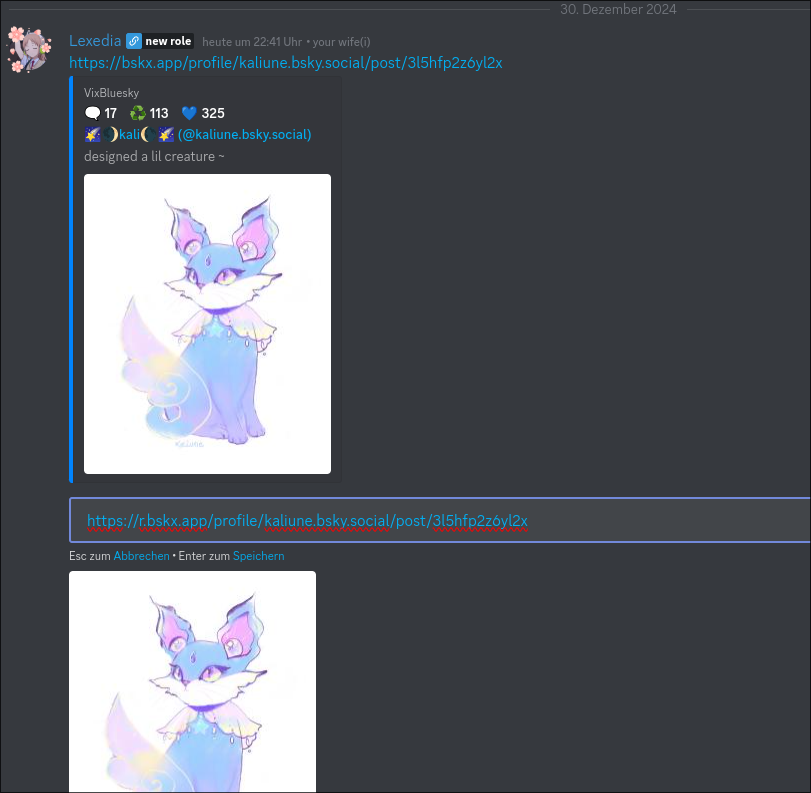

# VixBluesky 🛠️ (Inspired by [FixTweet](https://github.com/FixTweet/FixTweet))

Embed Bluesky links in Discord.

## Fix embeds with `s/y/x`.

> [!IMPORTANT]
> This is a fork of [FixBluesky](https://github.com/ThornbushHQ/FixBluesky) by [@ItsRauf](https://www.github.com/ItsRauf).
> All credits go to them for the original idea and implementation.

## How To Use?

#### Simply replace `y` with x in `bsky.app`. (`bsky.app` -> `bskx.app`)

## Direct Links

You want to link to a media directly? You can prepend `r.` to the URL to get a direct link.

## For developers
You can append `/json` at the end of each url to get the raw data VixBluesky receives.

> [!WARNING]
> __When querying the VixBluesky API, please DO use a descriptive User-Agent. This is used to your identify traffic and avoid abuse.__
> 
> A descriptive User-Agent should include at least: the name of the application, the version of the application (if applicable), and optionally a link to a website. 
> Generally, it should somewhat looks like this `YourApp (v1.7.10, https://repo.git (or any identifiable URL))`.

## Authors

- [@ItsRauf](https://www.github.com/ItsRauf) - Original author
- [@Lexedia](https://www.github.com/Lexedia)
